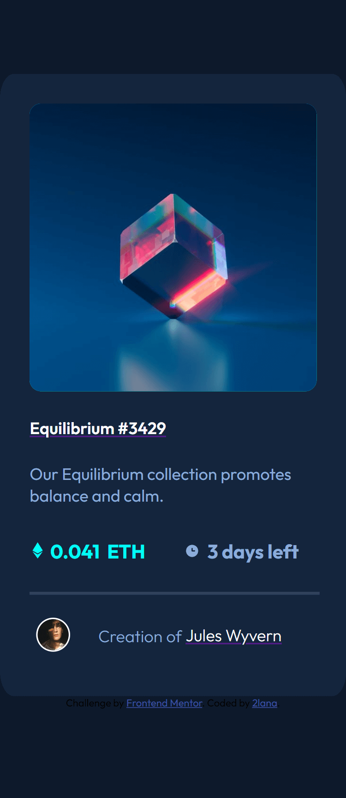
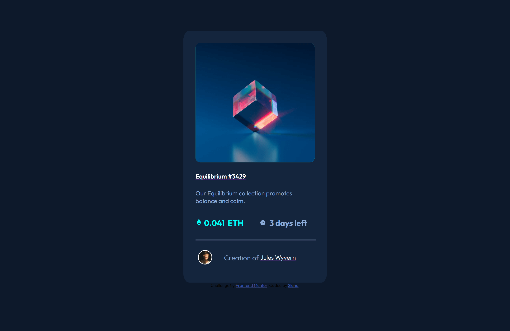

# Frontend Mentor - NFT preview card component solution

This is a solution to the [NFT preview card component challenge on Frontend Mentor](https://www.frontendmentor.io/challenges/nft-preview-card-component-SbdUL_w0U). Frontend Mentor challenges help me improve my coding skills by building realistic projects. 

## Table of contents

- [Overview](#overview)
  - [The challenge](#the-challenge)
  - [Screenshot](#screenshot)
  - [Links](#links)
- [My process](#my-process)
  - [Built with](#built-with)
  - [What I learned](#what-i-learned)
  - [Continued development](#continued-development)
  - [Useful resources](#useful-resources)
- [Author](#author)
- [Acknowledgments](#acknowledgments)


## Overview

### The challenge

Users should be able to:

- View the optimal layout depending on their device's screen size
- See hover states for interactive elements

### Screenshot





### Links

- Solution URL: [github](https://github.com/2lana/nft-preview-card-component)
- Live Site URL: [netlify](https://app.netlify.com/sites/adorable-daifuku-a22154/)

## My process

### Built with

- Semantic HTML5 markup
- CSS custom properties
- Flexbox
- CSS Grid
- Mobile-first workflow
- [Styled Components](https://styled-components.com/) - For styles

### What I learned

I learned elementary of semantic HTML5 markup, CSS custom properties, flexbox, grid, media queries, optimal layout depending on device's screen size, hover and focus states for interactive elements

My code snippets, see below:

```html
    <wrapper>
      
    </wrapper>
```
```css
wrapper {
    display: flex;
    flex-wrap: nowrap;
    align-items: center;
    justify-content: center;
    cursor: pointer; 
    background: var(--cyan);
    max-width: 100%;
    height: auto;
    border-radius: 4%;
}

wrapper img.image-equilibrium:hover {
    cursor: pointer; 
    opacity: 0.7;
    transition: .5s ease;        
}
```

But the service [validator](https://validator.w3.org/) detected an error, although this solution works. I believe that this solution should be using javascript but I'm just starting to learn her

```
Error: Element wrapper not allowed as child of element div in this context. (Suppressing further errors from this subtree.)

From line 15, column 6; to line 15, column 14

ge">↩     <wrapper>↩     

Content model for element div:
If the element is a child of a dl element: one or more dt elements followed by one or more dd elements, optionally intermixed with script-supporting elements.
If the element is not a child of a dl element: flow content.

```


### Continued development

I want to continue focusing on in future projects. These could be concepts still not completely comfortable with or techniques  found useful that  want to refine and perfect.


### Useful resources

- [slack](https://app.slack.com/) - This is community best practics
- [frontendmentor](https://www.frontendmentor.io/) - This resource gives me the opportunities to learn more about the use frontend and real practice code simple challenges for beginners. Respect!
- [freecodecamp](https://www.freecodecamp.org/) - This recource helped me learn to code
- [developer.mozilla](https://developer.mozilla.org) - This helped me as resourses for developers by developers.
- [w3schools](https://www.w3schools.com/) - This is an amazing resource which helped me better understand html, css. I'd recommend it to anyone still learning technical concept.
- [screen resolution simulator](https://searchenginereports.net/screen-resolution-simulator) - This is an amazing resource which helped me. 
- [Chrome DevTools](https://developer.chrome.com/docs/devtools/console/) - This recource help me testing html and css.
- [W3C](https://validator.w3.org/) - This recource help me checks the markup validity of Web documents in HTML and CSS.
- [docs.github](https://docs.github.com/en/get-started) - This recource helped me try to understand githab for the first time in my life. I created three repositories, two folders and deleted them several times, it’s a nightmare.

Most YouTube channels represent the author’s personal point of view. Only documentation should be examined.

### Author

- Website - [name here](https://app.netlify.com/sites/adorable-daifuku-a22154/)
- Frontend Mentor - [@2Lana](https://www.frontendmentor.io/profile/2lana)


Grateful for reading and reply to every constructive comment.
